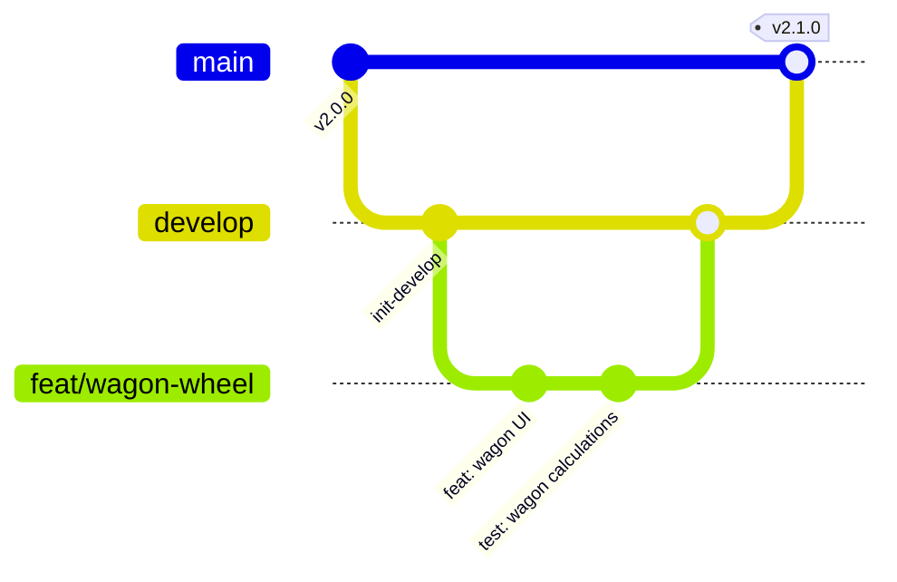

# Contributing to Cric Scorer Pro

Thank you for your interest in contributing to **Cric Scorer Pro**! We welcome community contributions to make this the best offline-first, enterprise-grade cricket scoring and tournament management platform available.

---

## 🧭 Code of Conduct

All contributors and participants are expected to adhere to our [Code of Conduct](CODE_OF_CONDUCT.md). Please treat all contributors with respect and consideration.

---

## 🌿 Branching Strategy & Workflow

We follow a structured Git branching strategy:

- **`main`**: Production-ready branch. Every commit on `main` is deployable.
- **`develop`**: Primary development and integration branch.
- **Feature Branches**: `feat/<short-description>` (branched from `develop`)
- **Bug Fix Branches**: `fix/<issue-description>` (branched from `develop` or `main`)
- **Documentation Branches**: `docs/<topic>`



---

## 🛠️ Development Setup

1. **Prerequisites**:
   - Node.js `20.x` or higher
   - npm `10.x` or higher

2. **Clone & Install**:
   ```bash
   git clone https://github.com/SHAKIBB7/Cricket.git
   cd Cricket
   npm install
   ```

3. **Environment Setup**:
   ```bash
   cp .env.example .env.local
   ```
   *(Note: The app runs 100% offline via IndexedDB even without Supabase credentials).*

4. **Start Development Server**:
   ```bash
   npm run dev
   ```
   Open [http://localhost:3000](http://localhost:3000) in your browser.

---

## 🧪 Quality Standards & Verification

Before submitting any Pull Request, ensure that all quality checks pass locally:

```bash
# 1. Run ESLint checks
npm run lint

# 2. Run unit & domain test suites
npm run test

# 3. Verify Next.js production build
npm run build
```

---

## 📝 Commit Message Guidelines

We enforce the [Conventional Commits](https://www.conventionalcommits.org/) specification:

- `feat:` A new feature or capability
- `fix:` A bug fix
- `docs:` Documentation-only changes
- `refactor:` Code refactoring that neither fixes a bug nor adds a feature
- `perf:` Performance optimizations
- `test:` Adding or updating tests
- `chore:` Build process, tooling, or dependency updates

**Examples:**
- `feat(scoring): add multi-bowler spell restriction rule`
- `fix(tournament): correct NRR calculation for all-out innings`
- `docs: update system architecture and offline sync documentation`

---

## 🚀 Pull Request Checklist

When submitting a Pull Request:

1. Target the `develop` branch for ongoing features, or `main` for hotfixes.
2. Provide a descriptive title and fill out the provided [Pull Request Template](.github/pull_request_template.md).
3. Ensure all tests (`npm run test`) pass.
4. Ensure zero ESLint warnings or errors (`npm run lint`).
5. Ensure production build succeeds (`npm run build`).
6. Avoid committing any secrets or local configuration files (`.env`, `.env.local`).
