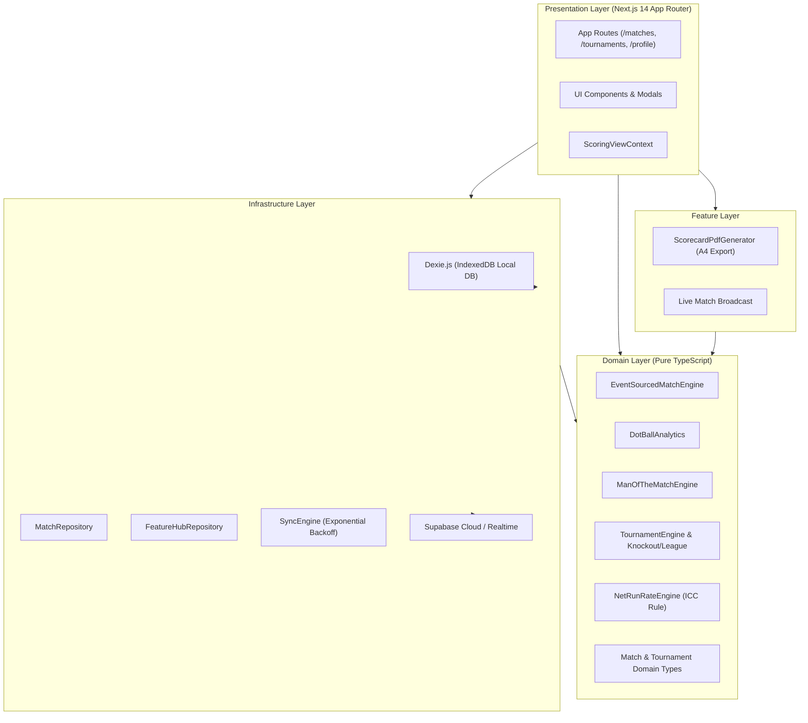

# 🏏 Cric Scorer Pro

> **Next-Generation Enterprise Cricket Scoring, Live Match Center & Tournament Management Platform**

[](https://nextjs.org/)
[](https://www.typescriptlang.org/)
[](https://tailwindcss.com/)
[](https://dexie.org/)
[](https://supabase.com/)
[](https://vitest.dev/)
[](LICENSE)

---

## 📌 Executive Overview

**Cric Scorer Pro** is a modern, enterprise-ready, cross-platform cricket scoring and tournament orchestration application built with **Next.js 14 (App Router)**, **TypeScript**, and **Tailwind CSS**. 

Architected with strict **Domain-Driven Design (DDD)** and an **Offline-First** storage model, Cric Scorer Pro enables grassroots clubs, schools, domestic leagues, and tournament organizers to record matches ball-by-ball with sub-millisecond local latency, generate professional broadcast-quality scorecards, track detailed player career statistics, and manage full-scale tournaments with official ICC-compliant Net Run Rate (NRR) calculations.

---

## ✨ Key Capabilities & Features

### 1. 🎯 Precision Event-Sourced Scoring Engine
- **Ball-by-Ball Tracking**: Runs (0, 1, 2, 3, 4, 6, custom runs), extras (Wide, No Ball, Byes, Leg Byes, Penalty Runs).
- **MCC Law 18.11 Compliance**: In Caught dismissals, incoming batter faces the next delivery (striker position preserved).
- **Free Hit Logic**: Automatically triggered on No Balls with strict dismissal restriction (only Run Out / Obstructing / Timed Out valid).
- **10 Dismissal Types**: Bowled, Caught, LBW, Run Out, Stumped, Hit Wicket, Retired Hurt, Retired Out, Obstructing the Field, Timed Out.
- **Accredited Wicket Attribution**: Bowlers are credited only for Bowled, Caught, LBW, Stumped, and Hit Wicket.
- **Maiden Over Computation**: Automatic maiden detection (0 bowler-charged runs in a 6-legal-ball over).
- **Deterministic 60-Step Undo**: Event playback mechanism enables seamless undo and historical ball modification without corrupting match state.
- **Safe Strike Rotation**: One-tap swap batsman with swipe/drag confirmation to prevent accidental touches on mobile.

### 2. 📊 Advanced Cricket Analytics
- **Dot Ball Analytics**: Real-time dot-ball percentage, streak calculation, and bowler vs. batter pressure indices.
- **Batting Intent Classification**: Heuristic profiling into *Finisher*, *Attacking*, *Anchor*, *Balanced*, or *Defensive* play styles.
- **Head-to-Head Matchup Matrix**: Batter vs. bowler statistics (balls faced, runs scored, strike rate, dismissals).
- **Official Man of the Match Engine**: Weighted multi-factor performance calculation evaluating batting impact, bowling milestones, maidens, and economy.

### 3. 🏆 Tournament Management System
- **Knockout Brackets**: Auto-bracket generation with automatic byes for odd team counts and single-elimination progression.
- **Round-Robin Leagues**: Configurable meeting schedules (single, double, triple round-robin), points tables (Win = 2, Tie = 1, Loss = 0).
- **IPL-Style Playoffs**: Automated 4-team playoff scheduling (Qualifier 1, Eliminator, Qualifier 2, Final).
- **Official ICC Net Run Rate (NRR)**: Implements the official ICC all-out quota rule (if a team is bowled out, full allotted overs are used as the denominator).
- **Tournament Leaderboards**: Real-time Orange Cap (Batting) and Purple Cap (Bowling) statistical standings.

### 4. 🎨 Multi-Theme Live Scoreboard & Reports
- **6 Built-in Themes**: `Sunrise`, `Ocean`, `Midnight`, `Stadium Green`, `Sunlight Contrast`, and `Royal Violet`.
- **A4 PDF Export**: Vector-quality, print-ready match report generation via `jspdf` and `jspdf-autotable`.
- **Match Summary & Share**: Detailed innings breakdowns, partnership graphs, and shareable match links.

### 5. 💾 Offline-First Architecture & Cloud Sync
- **100% Offline Scoring**: Powered by browser IndexedDB via **Dexie.js**; no network connection required during gameplay.
- **Hybrid Cloud Synchronization**: Optional integration with **Supabase** providing exponential-backoff sync and conflict copy branching.
- **Public Match Center**: Real-time match feed broadcasting via Supabase Realtime for live audience engagement.

---

## 🏛️ System Architecture

Cric Scorer Pro adopts **Clean Architecture** and **Domain-Driven Design (DDD)** principles to completely decouple business logic from UI and persistence frameworks:



---

## 📂 Repository Directory Structure

```text
├── .github/                      # GitHub Actions workflows & issue templates
│   ├── ISSUE_TEMPLATE/           # Bug report & feature request templates
│   ├── workflows/ci.yml          # Automated CI pipeline (lint, test, build)
│   └── pull_request_template.md  # Standardized PR review template
├── docs/                         # In-depth architectural & parity documentation
│   ├── FEATURE_PARITY.md         # Parity matrix with Flutter reference implementation
│   └── SYSTEM_ARCHITECTURE.md    # Detailed domain logic & mathematical formulas
├── public/                       # Static assets served by Next.js
│   ├── assets/                   # Vector animations, icon set, and illustrations
│   ├── icon.svg                  # Vector application favicon
│   └── manifest.json             # Progressive Web App (PWA) manifest
├── src/
│   ├── __tests__/                # Vitest test suites (engine, chase, NRR, leaks)
│   ├── app/                      # Next.js 14 App Router pages & layouts
│   │   ├── analytics/            # Performance analytics dashboard
│   │   ├── matches/              # Match setup, opening players, scoring & summary
│   │   ├── profile/              # User profile & preferences
│   │   ├── teams/                # Team management & squad builder
│   │   ├── tournaments/          # Tournament brackets, fixtures & standings
│   │   ├── globals.css           # Global Tailwind CSS and design tokens
│   │   └── layout.tsx            # Root HTML & metadata wrapper
│   ├── components/               # Reusable React components
│   │   ├── common/               # Badges, icons, buttons
│   │   ├── layout/               # Navigation bar, drawer
│   │   ├── modals/               # Batsman & Bowler profile modals
│   │   └── scoring/              # Live scoring panels, match controls
│   ├── context/                  # React Context providers (ScoringViewContext)
│   ├── domain/                   # Pure business logic (Zero external UI dependencies)
│   │   ├── cricket/              # Ball engine, dot analytics, MOM engine, types
│   │   └── tournament/           # Tournament fixtures, league tables, NRR engine
│   ├── features/                 # Application feature modules (PDF generator, etc.)
│   ├── infrastructure/           # Persistence, auth, and cloud sync
│   │   ├── auth/                 # Supabase authentication client
│   │   ├── database/             # Dexie IndexedDB schema & queries
│   │   ├── storage/              # Repositories (Matches, Teams, Tournaments)
│   │   └── sync/                 # Bidirectional background sync engine
│   └── lib/                      # Cross-cutting utilities & scoreboard theme tokens
├── .editorconfig                 # Cross-editor formatting specifications
├── .env.example                  # Environment configuration blueprint
├── .eslintrc.json                # ESLint configuration (Next.js core web vitals)
├── .gitignore                    # Production git ignore rules
├── CONTRIBUTING.md               # Guidelines for contributors & Git branching model
├── CODE_OF_CONDUCT.md            # Contributor Covenant Code of Conduct
├── LICENSE                       # MIT License
├── package.json                  # Dependencies & execution scripts
├── tailwind.config.js            # Tailwind CSS theme configuration
├── tsconfig.json                 # TypeScript compiler configuration
└── vitest.config.ts              # Vitest test runner configuration
```

---

## 🚀 Getting Started

### Prerequisites

Ensure you have the following installed on your machine:
- **Node.js**: `>= 20.0.0`
- **npm**: `>= 10.0.0` (or `pnpm` / `yarn`)

### Installation & Setup

1. **Clone the repository**:
   ```bash
   git clone https://github.com/SHAKIBB7/Cricket.git
   cd Cricket
   ```

2. **Install project dependencies**:
   ```bash
   npm install
   ```

3. **Configure Environment Variables**:
   Copy the provided `.env.example` to `.env.local`:
   ```bash
   cp .env.example .env.local
   ```
   > 💡 **Note**: Cric Scorer Pro is **100% functional offline**. You can run and use the full scoring and tournament suite without connecting Supabase. Cloud sync will automatically engage once valid keys are provided.

4. **Launch the development server**:
   ```bash
   npm run dev
   ```
   Open [http://localhost:3000](http://localhost:3000) in your browser.

---

## 🧪 Available Scripts

| Command | Description |
|---|---|
| `npm run dev` | Starts the Next.js local development server with Turbopack/HMR at `localhost:3000` |
| `npm run build` | Compiles an optimized production build of the Next.js application |
| `npm run start` | Boots the compiled Next.js production server |
| `npm run lint` | Runs ESLint over the entire codebase to ensure code quality |
| `npm run test` | Executes the Vitest unit and integration test suite |

---

## ⚙️ Environment Variables

All configuration options are defined in `.env.example`. Cric Scorer Pro is **100% functional offline** via Dexie IndexedDB v2 even if cloud keys are omitted.

| Variable | Required | Default | Description |
|---|---|---|---|
| `NEXT_PUBLIC_FIREBASE_API_KEY` | Optional / Recommended | `""` | Firebase Web API Key for Authentication & Firestore |
| `NEXT_PUBLIC_FIREBASE_AUTH_DOMAIN` | Optional / Recommended | `""` | Firebase Auth Domain (e.g. `cricket-proo.firebaseapp.com`) |
| `NEXT_PUBLIC_FIREBASE_PROJECT_ID` | Optional / Recommended | `""` | Firebase Project ID |
| `NEXT_PUBLIC_FIREBASE_STORAGE_BUCKET` | Optional / Recommended | `""` | Firebase Storage Bucket |
| `NEXT_PUBLIC_FIREBASE_MESSAGING_SENDER_ID` | Optional / Recommended | `""` | Firebase Messaging Sender ID |
| `NEXT_PUBLIC_FIREBASE_APP_ID` | Optional / Recommended | `""` | Firebase Web App ID |
| `NEXT_PUBLIC_FIREBASE_MEASUREMENT_ID` | Optional | `""` | Google Analytics 4 Measurement ID |
| `NEXT_PUBLIC_GOOGLE_CLIENT_ID` | Optional / Recommended | `""` | Google Cloud OAuth 2.0 Web Client ID for Google Drive Backup |
| `NEXT_PUBLIC_SUPABASE_URL` | Optional | `""` | Legacy Supabase synchronization URL (if enabled) |
| `NEXT_PUBLIC_SUPABASE_ANON_KEY` | Optional | `""` | Legacy Supabase public anon key |

---

## 🧪 Quality Assurance & Testing

Cric Scorer Pro is rigorously tested using **Vitest** (29 test suites, 243+ tests). The test suite includes:
- **`cricket-engine.test.ts` & `comprehensive-edge-cases.test.ts`**: Validates legal deliveries, dot balls, boundary runs, wicket attribution, maiden over detection, bowler limits, Free Hit restrictions, Wide overthrows, and 10-wicket All Out.
- **`chase-mode.test.ts`**: Tests second innings target calculation, required run rate (RRR), win margins, and match completion conditions.
- **`tournament-engine.test.ts`**: Verifies knockout brackets, round-robin points calculation, and official ICC Net Run Rate edge cases.
- **`offline-first-persistence.test.ts` & `sync-engine-outbox.test.ts`**: Verifies Dexie IndexedDB transactions, resilient outbox queueing, and conflict resolution.
- **`google-drive-backup.test.ts`**: Tests Google Drive OAuth token flow, encrypted payload assembly, cloud restore, and schema versioning.
- **`danger-zone-and-google-status.test.ts`**: Verifies the 3-second hold confirmation on destructive actions and Google connection status.

Run tests at any time with:
```bash
npm test
```

---

## 🚢 Deployment & Operations Runbook

For complete pre-flight instructions, zero-downtime rollback runbooks, and incident response procedures, consult the **[Production Deployment & Operations Runbook](docs/DEPLOYMENT_AND_OPERATIONS_RUNBOOK.md)**.

### Deploying to Vercel (Recommended)
1. Push your repository to GitHub.
2. Import the project into the [Vercel Dashboard](https://vercel.com/new).
3. Set your environment variables from `.env.example`.
4. Deploy:
   ```bash
   vercel --prod
   ```

### Deploying to Firebase Hosting
```bash
npm run build
firebase deploy --only hosting,firestore:rules
```

### Self-Hosted / Docker
To run on a standalone server:
```bash
npm run build
npm run start -p 3000
```

---

## 🤝 Contributing

We welcome contributions from the community! Please read our [CONTRIBUTING.md](CONTRIBUTING.md) and [CODE_OF_CONDUCT.md](CODE_OF_CONDUCT.md) before submitting pull requests.

### Git Branching Model
- `main` — Production-ready code.
- `develop` — Active development and integration.
- `feat/*` — Feature branches.
- `fix/*` — Bug fix branches.

---

## 📄 License

This project is open-source and distributed under the terms of the **[MIT License](LICENSE)**.

Copyright © 2026 [SHAKIBB7](https://github.com/SHAKIBB7).